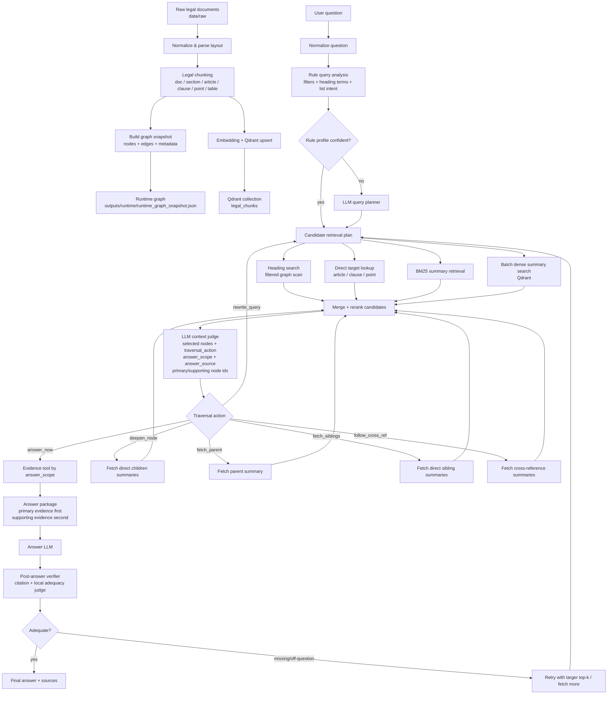

# Legislation GraphRAG

Legislation GraphRAG là hệ thống hỏi đáp văn bản pháp luật Việt Nam dùng kết hợp document parser, graph hierarchy, BM25, dense retrieval, rerank, LLM context judge và post-answer verification. Mục tiêu chính là trả lời câu hỏi dựa trên dữ liệu pháp luật đã ingest, không dựa vào tài liệu đang mở trên giao diện và không dùng thông tin ngoài context truy xuất.

Ứng dụng có hai phần chính:

- Web UI để duyệt tài liệu, xem nội dung văn bản và hỏi đáp.
- Backend GraphRAG để parse văn bản, xây graph điều/khoản/điểm/mục/phụ lục, truy xuất evidence và sinh câu trả lời có căn cứ.

## Tính Năng Chính

- Parse văn bản pháp luật Việt Nam thành các node có cấu trúc: văn bản, phần, mục, điều, khoản, điểm, bullet, bảng, phụ lục.
- Mỗi node chỉ giữ nội dung riêng của node đó; không tự gom nội dung cha/con vào cùng một node evidence.
- Truy xuất theo graph tree-guided: LLM được xem candidate preview ngắn gồm parent, children, siblings rồi quyết định đi tiếp hay trả lời.
- Hỗ trợ `answer_scope`: `exact`, `definition`, `summary`, `list`, `comparison`, `procedure`.
- Evidence được chia vai trò `primary` và `supporting` để LLM trả lời sát câu hỏi, tránh bị nhiễu bởi sibling hoặc context phụ.
- Có query planning/filter extraction cho số văn bản, loại văn bản, năm, điều, khoản, điểm và heading terms.
- Có RAGAS evaluation cho benchmark nội bộ.
- Có question debug log dạng JSONL để điều tra lỗi từng câu hỏi.
- Có local adequacy judge qua Ollama/Qwen để kiểm tra câu trả lời sau khi sinh.

## Kiến Trúc



## Retrieval Workflow

1. Người dùng nhập câu hỏi.
2. Hệ thống chuẩn hóa câu hỏi và trích xuất filter có cấu trúc như `doc_number`, `law_type`, `year`, `article`, `clause`, `point`.
3. Nếu rule profile đủ chắc, hệ thống dùng rule plan; nếu chưa đủ chắc, gọi LLM planner để rewrite/expand query.
4. Candidate retrieval lấy ứng viên từ nhiều đường:
   - heading search trong graph đã lọc,
   - direct target lookup nếu câu hỏi nêu rõ điều/khoản/điểm,
   - BM25 summary retrieval,
   - batch dense search trên Qdrant.
5. Candidate được rerank và làm giàu bằng preview ngắn của parent/children/sibling.
6. LLM context judge quyết định:
   - chọn node nào,
   - có cần đi cha/con/sibling không,
   - `answer_scope` là gì,
   - `answer_source` lấy từ own text, heading, parent, children hay siblings,
   - node nào là primary/supporting.
7. Evidence tool fetch đúng dữ liệu theo `answer_scope`:
   - `exact`: lấy câu/vị trí trả lời trực tiếp, không liệt kê lan.
   - `definition`: lấy định nghĩa hoặc điều khoản định nghĩa.
   - `summary`: lấy primary evidence và hỗ trợ ngắn.
   - `list`: nếu cần danh sách, lấy đầy đủ direct children hoặc direct siblings theo quyết định của judge.
   - `comparison`: lấy các nhóm evidence cần so sánh.
   - `procedure`: lấy bước, điều kiện, thời hạn, trách nhiệm theo trình tự.
8. Answer LLM sinh câu trả lời từ primary evidence, chỉ dùng supporting evidence để kiểm tra/bổ sung.
9. Post-answer verifier kiểm tra citation và local adequacy. Nếu câu trả lời lệch hoặc thiếu, pipeline có thể retry với top-k lớn hơn.

## Cài Đặt

Yêu cầu:

- Python 3.11+
- Docker Desktop nếu dùng Qdrant local
- OpenAI API key cho embedding, LLM judge, answer generation và RAGAS evaluator
- Ollama nếu muốn dùng local adequacy judge

Tạo môi trường:

```bat
cd C:\AI\RAG
python -m venv .venv
.venv\Scripts\activate
pip install -e .
```

Tạo file cấu hình:

```bat
copy .env.example .env
```

Điền tối thiểu các biến sau trong `.env`:

```env
OPENAI_API_KEY=...
QDRANT_URL=http://localhost:6333
QDRANT_API_KEY=
QDRANT_COLLECTION=legal_chunks
RETRIEVAL_PIPELINE=tree_guided
```

## Chạy Qdrant Local

```bat
docker compose up -d qdrant
```

Kiểm tra Qdrant:

```bat
curl http://localhost:6333/collections
```

## Ingest Dữ Liệu

Đưa tài liệu nguồn vào `data/raw`, sau đó chạy:

```bat
python scripts/ingest.py --normalize
```

Lệnh ingest sẽ:

- normalize dữ liệu từ `data/raw` sang `data/normalized`,
- parse layout pháp luật,
- chunk theo cấu trúc pháp lý,
- tạo embedding,
- upsert vào Qdrant.

Nếu cần rebuild graph snapshot từ dữ liệu normalized:

```bat
python -m src.app.runtime
```

Hoặc dùng API/runtime khi server khởi động; nếu snapshot chưa có, hệ thống sẽ tự build từ `data/normalized`.

## Chạy Web App

Lệnh chạy server:

```bat
cd C:\AI\RAG
.venv\Scripts\activate
set PYTHONIOENCODING=utf-8
python -m uvicorn src.app.main:app --host 127.0.0.1 --port 8000
```

Mở:

```text
http://127.0.0.1:8000/
```

Giao diện gồm:

- danh sách văn bản,
- khung xem nội dung tài liệu,
- ô nhập câu hỏi,
- phần hội thoại trả lời.

Debug flow không hiển thị trên UI chính. Log debug được ghi riêng để điều tra lỗi.

## Debug Câu Hỏi

Mỗi request chat được ghi vào:

```text
outputs/debug/question_debug.jsonl
```

Tìm log theo câu hỏi:

```bat
python scripts/find_question_debug_log.py "nội dung câu hỏi cần tìm"
```

Khi debug một câu sai, nên kiểm tra:

- câu hỏi người dùng,
- câu trả lời hệ thống,
- `query_profile`,
- `summary_candidates`,
- `navigation_trace`,
- `debug_flow.evidence`,
- `answer_scope`,
- `answer_source`,
- `primary_node_ids`,
- `supporting_node_ids`,
- local adequacy judgement,
- post-answer verification.

## Chạy RAGAS

RAGAS local dùng Qdrant local và collection `legal_chunks`:

```bat
scripts\run_local_ragas.bat --input data\eval\legal_rag_benchmark_25.json --top-k 5
```

Nếu dùng local judge Qwen/Ollama và muốn timeout cao:

```bat
set OLLAMA_JUDGE_TIMEOUT_S=180
set LOCAL_JUDGE_PROVIDER=auto
scripts\run_local_ragas.bat --input data\eval\legal_rag_benchmark_25.json --top-k 5
```

Kết quả được ghi vào:

```text
data/eval/rag_outputs.jsonl
data/eval/ragas_results.json
```

Kết quả gần nhất sau khi áp dụng tree-guided workflow:

```text
faithfulness        0.69
answer_relevancy    0.53
context_precision   0.97
context_recall      0.93
answer_correctness  0.66
```

Local adequacy judge bằng Ollama/Qwen trên output hiện tại:

```text
provider=ollama: 25/25
adequate: 21/25
not adequate: 4/25
```

## Lệnh Test

Chạy nhóm test chính:

```bat
.venv\Scripts\python.exe -m pytest tests -q
```

Nếu Windows chặn thư mục temp mặc định, đặt temp trong workspace:

```bat
mkdir .pytest_tmp
set TEMP=C:\AI\RAG\.pytest_tmp
set TMP=C:\AI\RAG\.pytest_tmp
.venv\Scripts\python.exe -m pytest tests -q
```

Chạy test liên quan pipeline mới:

```bat
.venv\Scripts\python.exe -m pytest tests\test_tree_guided_pipeline.py tests\test_local_adequacy_judge.py tests\test_qa_engine_direct_list.py -q
```

## Cấu Hình Quan Trọng

```env
RETRIEVAL_PIPELINE=tree_guided
ENABLE_LLM_TREE_JUDGE=1
TREE_SUMMARY_TOP_K=12
TREE_JUDGE_TOP_K=4
TREE_EVIDENCE_TOP_K=4
TREE_MAX_HOPS=3
TREE_JUDGE_CONFIDENCE_THRESHOLD=0.6

ENABLE_LOCAL_ADEQUACY_JUDGE=1
LOCAL_JUDGE_PROVIDER=auto
OLLAMA_BASE_URL=http://localhost:11434
OLLAMA_JUDGE_MODEL=qwen3.5:9b-q4_K_M
OLLAMA_JUDGE_TIMEOUT_S=20
```

Với Qwen/Ollama, local judge gửi `think:false` để model trả JSON ngắn thay vì suy nghĩ quá lâu.

## Ghi Chú Thiết Kế

- UI chỉ dùng để người dùng xem tài liệu và nhập câu hỏi; backend không được lấy nội dung từ file đang mở để trả lời.
- Dữ liệu trả lời phải đến từ retrieval pipeline.
- Node pháp lý không gom nội dung cha/con vào `text` của node.
- Muốn đi sâu xuống children, lên parent hoặc lấy siblings phải qua traversal decision.
- Với câu hỏi dạng danh sách, chỉ lấy đầy đủ children/siblings khi judge quyết định đúng scope/relation.
- Với câu hỏi exact/factoid, supporting evidence không được kéo câu trả lời sang dạng liệt kê.
